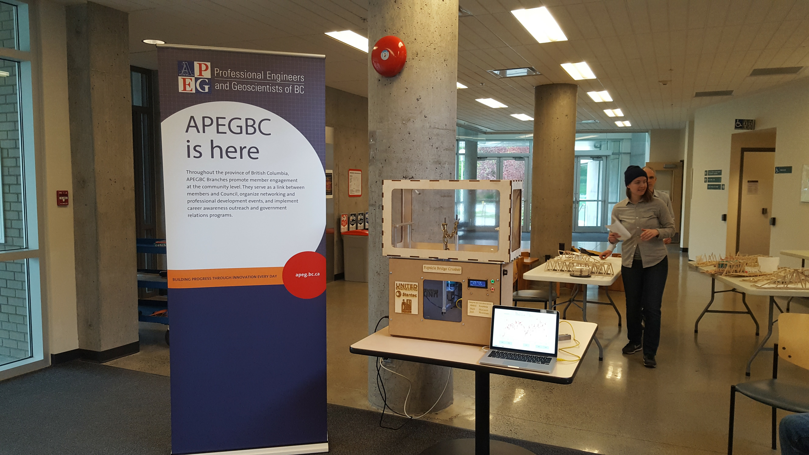

# Bridge Crusher
The Bridge Crusher was created for EGBC (formerly APEGBC) for their popsicle stick bridge crushing event. The machine was developed and created by [Joel Newman](mailto:JoellNewman@Hotmail.com?subject=[GitHub]%20bBridge%20Crusher), [Abdul Forteia](mailto:afourteia@gmail.com?subject=[GitHub]%20Bridge%20Crusher), and Mat McCann. The Bridge Crusher can handle up to 500kg of applied force before damage to the force sensor. The machine will only display forces up to 300kg.

## Requirements
The main requirements to run this code is python 2.7 and the Bridge Crusher plugged in via USB. If you do not have the required software besides python the program will try and automatically install the required libraries.

## Instructions
### Steps to run the software
It is recommended that the Dataplotting_using_matplotlib.py is used. The other files are attempts to get the speed of that file but with a nicer interface. That was not accomplished but are included in case more development is warranted in the future.

To run this software you can double click on the file or open a terminal and type in "python Dataplotting_using_matplotlib.py"

### Steps to run the hardware
This machine is capable of applying large amounts of force so caution must be used whenever people are around the machine.

1. Remove lid
2. Insert bridge to be tested making sure to have the bar or chain in place to apply the force to the bridge
3. Make sure all wing nuts are tightened
4. Replace lid. NOTE: when lid is in place you should hear a small click to indicate that the limit switch that senses the lid is depressed.
5. (optional) Press reset in the software or use the wheel on the machine to reset the current forces.
6. Press Start on the machine or in the software
7. The machine will proceed to crush the bridge at a constant rate (constant force increase)
8. Press Stop on the machine or in the software at any time to stop the test. NOTE the machine will stop when it has reached its full extension or if the lid is removed.
9. Press home on the software or in the menus on the machine itself to have the machine return the starting location. The machine will automatically stop when it has reached its home location.
10. (optional) save the results in the software using ctrl+s
11. Repeat
